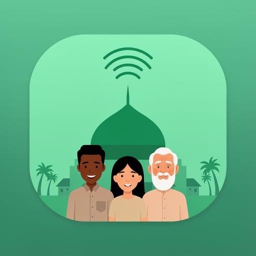
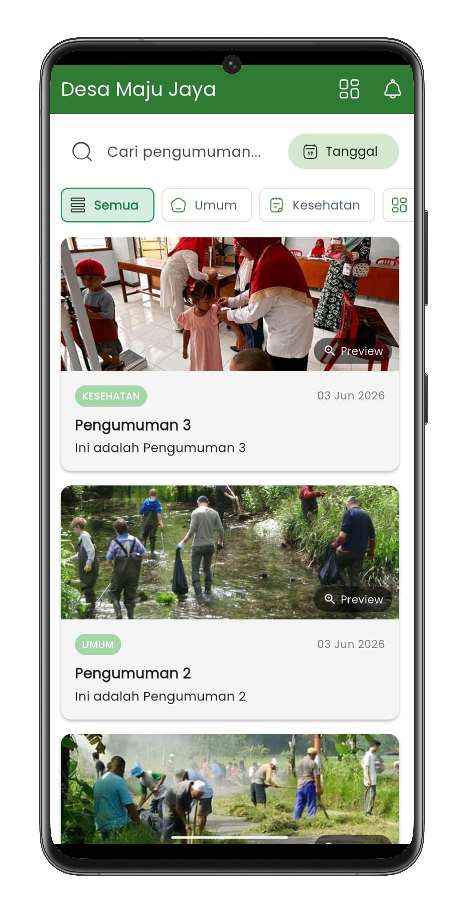

  

# 1. Nama Project

<h1 align="center">Pengumuman KBS</h1>

  <strong>Aplikasi Pengumuman Kampung Baru Sukaraja</strong>

  
  
  
  

## 2. Deskripsi Singkat

Pengumuman KBS adalah aplikasi mobile untuk menyampaikan informasi resmi Kampung Baru Sukaraja kepada warga secara cepat, rapi, dan real-time. Warga dapat membaca pengumuman tanpa login, sementara admin dapat mengelola konten melalui panel khusus.

Aplikasi ini dibuat agar informasi penting seperti kegiatan warga, kesehatan, infrastruktur, keuangan, dan acara kampung bisa tersampaikan lebih mudah lewat perangkat mobile.

## 3. Problem atau Masalah yang Diselesaikan

- Pengumuman manual mudah terlewat karena hanya tersebar lewat papan informasi, grup chat, atau pesan berantai.
- Informasi tidak selalu sampai ke semua warga secara merata dan tepat waktu.
- Admin membutuhkan media terpusat untuk membuat, mengedit, mempublikasikan, dan menghapus pengumuman.
- Warga membutuhkan akses informasi yang sederhana tanpa proses login yang menyulitkan.
- Pengumuman penting perlu didukung notifikasi agar warga segera mengetahui informasi terbaru.

## 4. Fitur Utama

- Feed pengumuman warga tanpa login.
- Pencarian pengumuman berdasarkan judul, isi, atau kategori.
- Filter pengumuman berdasarkan kategori dan tanggal.
- Kategori pengumuman: umum, kesehatan, infrastruktur, keuangan, dan acara.
- Preview gambar pengumuman dan halaman detail dengan tampilan gambar yang bisa diperbesar.
- Panel admin untuk membuat, mengedit, menghapus, dan mengatur status pengumuman.
- Status pengumuman draft dan published.
- Data pengumuman real-time menggunakan Supabase Realtime.
- Push notification menggunakan OneSignal saat pengumuman baru dipublikasikan.
- Dukungan distribusi APK mandiri dengan manifest update.

## 5. Screenshot

  

## 6. Tech Stack + Icon

  
  
  
  
  
  
  
  
  

| Teknologi | Fungsi |
| --- | --- |
| Flutter | Framework utama untuk membangun aplikasi mobile lintas platform. |
| Dart | Bahasa pemrograman utama aplikasi. |
| Supabase | Backend untuk database, authentication, storage gambar, dan realtime stream. |
| Riverpod | State management untuk mengelola data pengumuman dan admin. |
| GoRouter | Navigasi antar halaman seperti splash, home, detail, login admin, dan dashboard admin. |
| OneSignal | Push notification untuk pengumuman baru. |
| Android | Target distribusi APK untuk pengguna mobile. |
| GitHub Actions | Workflow CI/CD, build, dan distribusi release. |
| Lottie | Animasi ringan untuk mempercantik pengalaman pengguna. |
